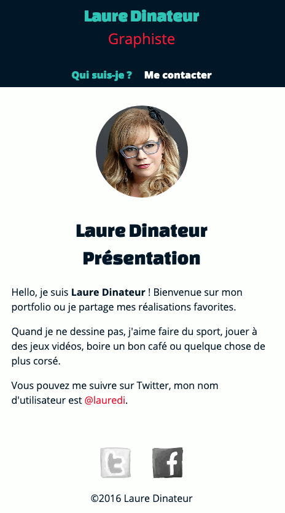
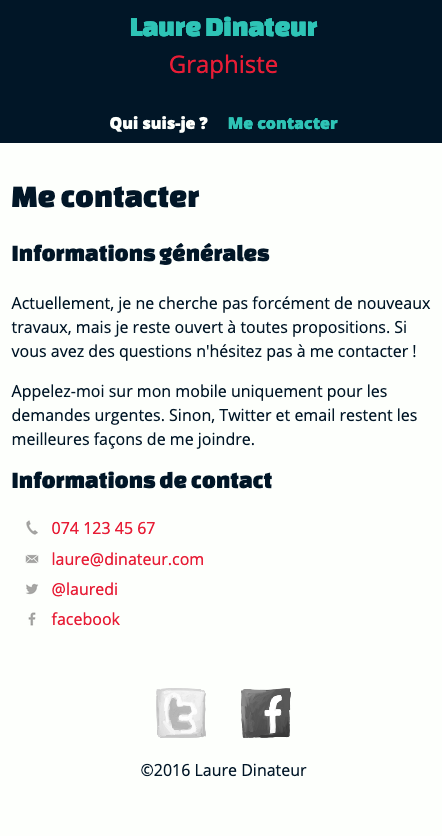
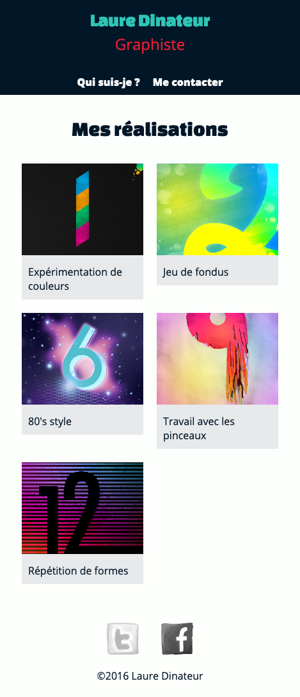
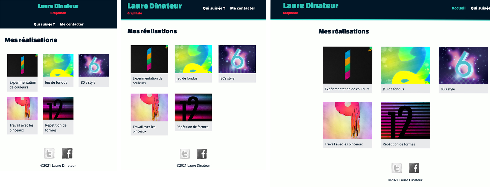

# Exercice site Laure Dinateur version mobile

## Objectifs

* Créer le site internet de la graphiste *Laure Dinateu*r en se basant sur les
  maquettes, images, textes et instructions fournis par le designer.
* Ce site se divise en **3 pages** :
  * `index.html` page d'accueil du site présentant une galerie de 5
    réalisations de Laure Dinateur
  * `informations.html` présentation Laure Dinateur en 3 paragraphes
  * `contact.html` Paragraphes d'informations générales et liste des
    différents moyens de contact.
* Le code CSS du site doit être contenu dans une **feuille de style externe** `main.
  css`. Ce fichier n'existe pas, vous devrez le créer et le lier à vos pages HTML.
* Le code HTML et CSS doit **respecter les standards du W3C** et **doit être validé**
  sur le site https://validator.w3.org/

## Documents utiles

Vous trouverez tous les fichiers utiles à la réalisation du site dans le dossier `_sources/` de ce projet.

Liste des fichiers :
* `images/` ce dossier contient les réalisations, photos et logos et icônes du
  site.
* `maquettes/` les maquettes du site.
* `base.html` fichier HTML de base à copier pour créer vos pages
  HTML.
* `lauredi-contenus.txt` les textes du site.
* `palette.pdf`, `palette.png`, `palette.url` la palette des couleurs du site
  dans différents formats.

## Structure générale du site

Aspect général :
* Couleur d'arrière-plan : `#fdfffc`
* Couleur du texte `#011627`
* Tailles du texte `100%`
* Hauteur de ligne `1.4`
* Police du texte Open Sans`, épaisseur 400 -
  https://fonts.google.com/specimen/Open+Sans
* Police des titres `Changa One`, épaisseur 400 -
  https://fonts.google.com/specimen/Changa+One
* Tailles des titres de niveau 1 `2rem`
  * Marge extérieure en bas de `1em`
* Tailles des titres de niveau 2 `1.5rem`
  * Marge extérieure en bas de `.75em`
* Hauteur de ligne des paragraphes `1.5`
* Les liens du site sont rouges `#e71d36` et ne sont **pas soulignés**
* Les images ont une largeur maximum de `100%`.
  Cela empêche les images de sortir de leur parent, voir du navigateur.

Le site se divise en trois parties :
* Entête
* Contenu principal
* Pied de page

### Entête `<header>`
L'entête se compose d'un **logo texte** et d'un **menu de navigation**

* Les contenus, textes, de l'entête sont centrés horizontalement.
* La couleur de fond de l'entête est bleu foncé `#011627`
* L'entête à une marge intérieur en haut de `5px` et extérieure en bas de `30px`

#### Logo texte
* Lorsqu'on clique sur le logo, cela nous renvoie à la page d'accueil `index.
  html`
* La taille du texte "Laure Dinateur" est de `1.75rem`,
  a une hauteur de ligne de `0.8`,
  une couleur bleu clair `#2ec4b6`,
  utilise la police `'Changa One'` avec épaisseur de `400` et a une marge
  extérieure en haut et en bas de `1rem`.
* Le texte "Graphiste" a une marge extérieure haut de `-5px`, 
  dans le but de le rapprocher du texte "Laure Dinateur".

#### Menu de navigation

* Le menu de navigation `<nav>` contient une **liste `<ul>` de trois liens**.
  Mais sur mobile, seuls deux sont visibles,
  car il n'y a pas assez de place en largeur sur les petits terminaux.
* Liste des liens du menu :
  * **Accueil** `index.html` - caché en CSS `display:none;`
  * **Qui suis-je ?** `informations.html`
  * **Me contacter** `contact.html`
* Les éléments de la liste du menu `<li>` s'affichent **sans puces, sans marge
  intérieure et en ligne** `display:inline-block;`
* Pour faciliter la sélection des liens sur mobile, les liens sont espacés de
  `30px`.
* La couleur du texte des liens devient bleue `#2ec4b6` lorsqu'ils sont
  survolés `:hover`.

### Contenu principal `<main>`
Contiens le titre principal de la page et ses contenus (images, paragraphes,
titres, sections, liens, éléments importants, figures avec légende)

* Le contenu principal à une marge extérieure gauche et droite de 5%.

### Pied de page `<footer>`
Contiens la **liste des réseaux sociaux** de Laure Dinateur et le **copyright**.
* Les contenus du pied de page sont centrés horizontalement.
* La liste des réseaux sociaux est un élément de navigation `<nav>`, tout
  comme le menu de navigation de l'entête.
* Les images ont une largeur de `50px` sont espacées de `30px`.
* Un filtre gris CSS est appliqué aux images du pied de page `filter: grayscale
  (1);`
* Lorsqu'on passe au-dessus des images avec la souris `:hover`, les images
  reprennent des couleurs `filter: grayscale(0);` avec une transition
  `transition: filter 500ms linear;`

## Travail #1 - Réaliser la page _Qui suis-je ?_

La page de présentation _Qui suis-je ?_ `informations.html` est la plus
simple du site, elle se compose de :
* une image
* un titre principal
* trois paragraphes
* un lien vers le Twitter de Laure Dinateur https://twitter.com/lauredi

Vous devez créer cette page en vous basant sur les instructions de la
_Structure générale du site_ et des différents contenus : textes, palettes,
maquettes, images, ....

### Maquette

### Instructions du designer
* Utiliser les bordures arrondies CSS `border-radius` pour donner la forme de
  cercle à l'image.

## Travail #2 - Réaliser la page _Me contacter_

La page de contact _Me contacter_ `contact.html` contient :
* un titre principal
* deux sections`<section>` :
  *  section `infos` :
  * un titre secondaire
  * deux paragraphes
  * section `contact`
    * liste de contacts `<ul>`

### Maquette

### Instructions du designer

* Utiliser les images d'arrière-plan pour placer les icônes de la liste
  * Article expliquant comment procéder :
    https://openweb.eu.org/articles/puces_images
  * Les fichiers des icônes sont :
    * `phone.png`
    * `mail.png`
    * `twitter.png`
    * `facebook.png`

## Travail #3 - Réaliser la page _Accueil_

Les contenus de la page d'accueil sont :
* un titre principal
* une galerie, liste `<ul>`, d'images
  * Les images et leur description sont contenues dans un lien
  * Lorsqu'on clique sur ce lien, cela ouvre l'image dans un nouvel onglet
  * Utiliser les éléments HTML `<figure>` et `<figcaption>` pour délimiter les
    images et leur description
  * Lire cet article : https://www.alsacreations.com/article/lire/1337-html5-elements-figure-et-figcaption.html

### Maquette

### Instructions du designer
* Afficher les images sur deux colonnes en utilisant la technique
  `display:inline-block`
* Les éléments de la liste d'images `<li>` font `45%` de largeur et ont une
  marge extérieure de `2.5%`.
* Aligner verticalement les éléments `<li>` par le haut `vertical-align:top;`
* La légende des images à une marge intérieure de `10px` et une taille de
  texte de `1rem`.
* Le débordement `overflow` du texte de la légende doit être masqué.

## Travail #4 - Rendre le site "Responsive"

Créer un feuille de style `responsive.css` dans le dosser `css/` et utiliser
les media queries pour appliquer les règles suivantes aux différentes
tailles d'écrans.

### Écrans >= 480px

* Page d'accueil
  * Afficher la galerie sur trois colonnes.
  * **Astuce :** utiliser la fonction CSS `calc()`
    https://developer.mozilla.org/fr/docs/Web/CSS/calc()
* Page informations
  * Faire flotter la photo de Laure Dinateur à gauche du titre.
  *  **Astuce :** Utiliser la propriété CSS `float`
     https://developer.mozilla.org/fr/docs/Web/CSS/float
* Page de contact
  * Afficher les deux sections sur deux colonnes
    * A gauche : Informations générales
      * Largeur: `50%`
    * A droite:  Informations de contact
      * Largeur: `40%`
      * Marge extérieure gauche: `10%`

### Écrans >= 660px

* Entête du site
  * Ajouter un bordure bleue `#2ec4b6` de `5px` d'épaisseur en bas de l'entête
  * Afficher le logo à gauche et le menu à droite
    * Logo
      * largeur : `42%`
      * marge extérieure gauche : `5%`
      * Alignement du texte à gauche
      * "Laure Dinateur" taille du texte de `2.5rem`
      * "Graphiste" marge extérieur en bas de `20px`
    * Menu
      * Largeur : `48%`
      * marge extérieure droite : `5%`
      * Taille du texte : `1.125rem`

### Écrans >= 910px

* Entête du site
  * Afficher le lien vers la page d'acceuil dans le menu
* Contenu principal et pied de page
  * Largeur maximale `910px` moin `5%` de marge extérieure
  * **Astuce :** utiliser la fonction CSS `calc()`
    https://developer.mozilla.org/fr/docs/Web/CSS/calc()
    
